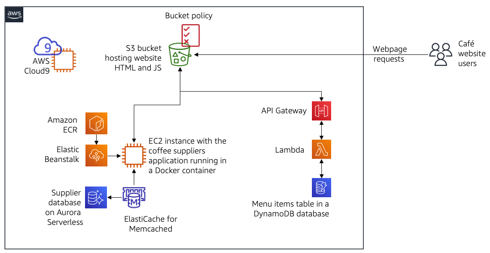
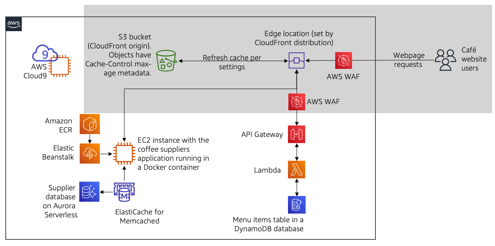

# Implementing CloudFront for Caching and Application Security

> In this lab most of the work has been done on the managment console

## lab objectives:

* Create a CloudFront distribution to cache Amazon Simple Storage Service (Amazon S3) objects
* Configure a website hosted on Amazon S3 to be available through HTTPS using CloudFront
* Secure access to the CloudFront distribution based on the network origin of the request
* Secure a REST API endpoint based on the network origin of the request using AWS WAF
* Configure a CloudFront function to affect website behavior from the edge
* Adjust max-age caching settings on a CloudFront distribution

## initial state

## final state
